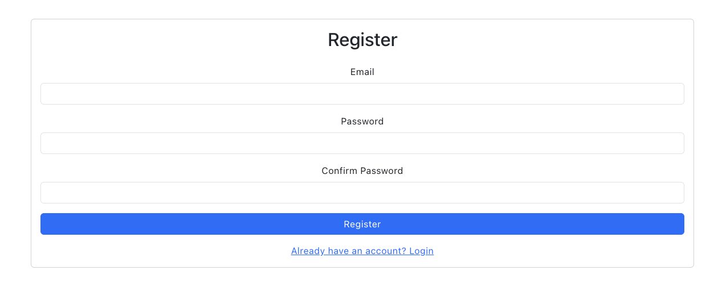
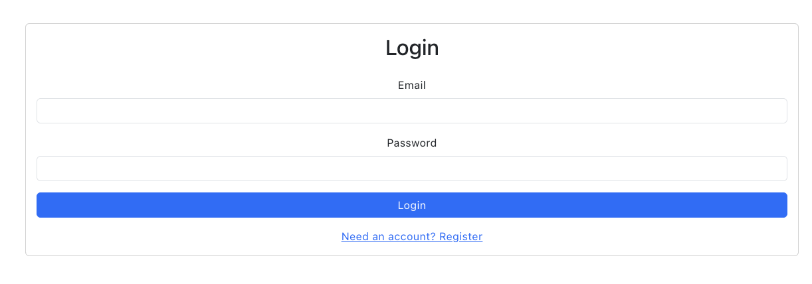
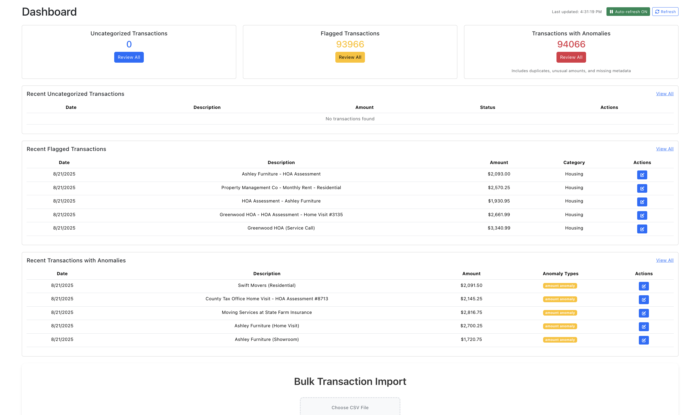
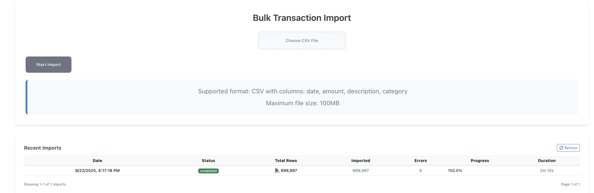
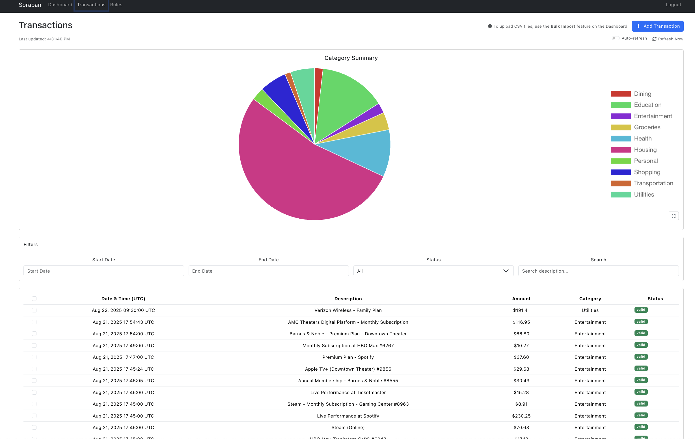
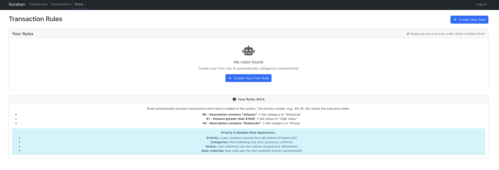
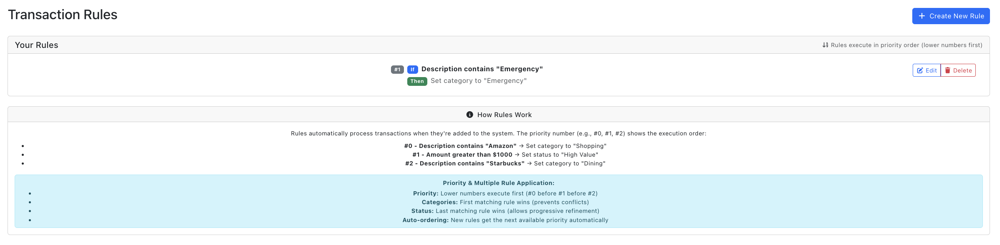

# Soraban Bookkeeping System - Application Architecture & Features

## Table of Contents
0. [Demonstration Video](#demonstration-video)
1. [Application Overview](#application-overview)
2. [Architecture Design](#architecture-design)
3. [Performance Optimizations](#performance-optimizations)
4. [Features Implementation](#features-implementation)
5. [Rule System](#rule-system)
6. [Frontend Components](#frontend-components)
7. [Backend Services](#backend-services)
8. [Development Decisions](#development-decisions)
9. [System Workflows](#system-workflows)
10. [Technical Achievements](#technical-achievements)
11. [Screenshots](#screenshots)

## Demonstration Video

- 

- [Demonstration Video](Recordings/Soraban%20Engineering%20Project%20-%20Technical%20Demonstration%20-%20Simple.mp4)

## Application Overview

The Soraban Bookkeeping System is a high-performance, scalable financial transaction management application built with Ruby on Rails 7.1 backend and React frontend. The system efficiently handles large datasets (1M+ transactions) with sub-100ms response times while providing comprehensive categorization, anomaly detection, and bulk operations.

### Key Features
- **High-Performance Dashboard**: Progressive loading with 2-5KB responses
- **Advanced Rule System**: Priority-based rule application with multiple rule support
- **Bulk Import System**: Real-time progress tracking for large CSV imports
- **Anomaly Detection**: Automated detection of duplicates, unusual amounts, and missing data
- **Comprehensive Transaction Management**: Full CRUD operations with optimized pagination
- **Real-time Updates**: Polling-based progress tracking and live data updates

## Architecture Design

### System Architecture
```
┌─────────────────┐    ┌─────────────────┐    ┌─────────────────┐
│   React Frontend │    │  Rails Backend  │    │   PostgreSQL    │
│                 │    │                 │    │    Database     │
│ - Progressive   │◄──►│ - Optimized     │◄──►│                 │
│   Loading       │    │   Controllers   │    │ - Indexed       │
│ - Real-time     │    │ - Redis Caching │    │   Tables        │
│   Updates       │    │ - Manual        │    │ - Optimized     │
│ - Component     │    │   Serialization │    │   Queries       │
│   Architecture  │    │                 │    │                 │
└─────────────────┘    └─────────────────┘    └─────────────────┘
```

### Technology Stack
- **Backend**: Ruby on Rails 7.1, Redis for caching, PostgreSQL
- **Frontend**: React 18, Bootstrap 5, Chart.js for visualizations
- **Performance**: Manual serialization, progressive loading, Redis caching
- **Communication**: RESTful APIs with optimized response formats

## Performance Optimizations

### Critical Performance Achievements
- **Dashboard Loading**: Reduced from 19MB/9s to 2-5KB/<100ms (99.97% reduction)
- **Categories API**: Reduced from 76MB/21s to instant loading
- **Transaction List**: Progressive loading with pagination and lightweight responses

### Optimization Techniques

#### 1. Manual Serialization
Replaced heavy ActiveModel serializers with lightweight manual serialization:
```ruby
# Lightweight serialization for performance
def serialize_transaction_light(transaction)
  {
    id: transaction.id,
    date: transaction.date,
    amount: transaction.amount,
    description: transaction.description&.truncate(50),
    category_name: transaction.category&.name,
    status: transaction.status
  }
end
```

#### 2. Progressive Loading
Implemented chunked data loading for large datasets:
```javascript
// Progressive loading pattern
const loadTransactions = async (page = 1) => {
  setLoading(true);
  try {
    const response = await transactionService.getTransactions(page, pageSize);
    setTransactions(prev => page === 1 ? response.transactions : [...prev, ...response.transactions]);
  } finally {
    setLoading(false);
  }
};
```

#### 3. Redis Caching
Strategic caching for frequently accessed data:
```ruby
def categories_summary
  Rails.cache.fetch("categories_summary", expires_in: 1.hour) do
    Category.includes(:transactions)
            .map { |category| serialize_category_summary(category) }
  end
end
```

## Features Implementation

### 1. Transaction Management
- **CRUD Operations**: Full transaction lifecycle management
- **Bulk Operations**: Multi-transaction categorization and status updates
- **Search & Filter**: Real-time search with category and status filters
- **Import/Export**: CSV import with progress tracking and error handling

### 2. Rule-Based Categorization
- **Priority System**: Rules applied based on order field (lower number = higher priority)
- **Multiple Rules**: Transactions can match and apply multiple rules
- **Rule Types**: Category rules and status rules for comprehensive automation
- **Real-time Application**: Rules automatically applied to new transactions

### 3. Anomaly Detection
- **Duplicate Detection**: Identifies potential duplicate transactions
- **Amount Anomalies**: Flags unusually large or small amounts
- **Missing Data**: Detects incomplete transaction information
- **Automated Flagging**: Background jobs for continuous monitoring

### 4. Bulk Import System
- **Large File Handling**: Efficiently processes large CSV files
- **Progress Tracking**: Real-time progress updates via polling
- **Error Handling**: Comprehensive error reporting and recovery
- **Background Processing**: Non-blocking import operations

## Rule System

### Rule Architecture
The rule system implements a priority-based approach where multiple rules can be applied to a single transaction:

```ruby
class Rule < ApplicationRecord
  # Priority-based ordering (lower number = higher priority)
  scope :ordered, -> { order(:order) }
  
  # Rule types
  validates :rule_type, inclusion: { in: %w[category status] }
  
  def apply_to_transaction(transaction)
    case rule_type
    when 'category'
      apply_category_rule(transaction)
    when 'status'
      apply_status_rule(transaction)
    end
  end
end
```

### Rule Application Process
1. **Match Evaluation**: Check if transaction matches rule conditions
2. **Priority Ordering**: Apply rules in priority order (order field)
3. **Multiple Application**: Allow multiple rules to modify different aspects
4. **Automatic Processing**: Apply to new transactions and bulk operations

## Frontend Components

### Component Architecture
```
src/components/
├── Dashboard/                 # Main dashboard with KPIs and charts
├── TransactionList/          # Comprehensive transaction management
├── Rules/                    # Rule creation and management
├── BulkImport/              # File import with progress tracking
├── Categories/              # Category management
├── Forms/                   # Reusable form components
├── Tables/                  # Optimized table components
└── Navigation/              # Application navigation
```

### Key Component Features
- **Dashboard**: Real-time KPIs, spending trends, and quick actions
- **TransactionList**: Advanced filtering, bulk operations, and inline editing
- **Rules**: Visual rule builder with priority management
- **BulkImport**: Simple import with real-time progress
- **Tables**: Virtualized tables for large datasets with sorting and pagination

## Backend Services

### Service Layer Architecture
```
app/services/
├── transaction_service.rb    # Transaction business logic
├── rule_service.rb          # Rule application and management
├── anomaly_service.rb       # Anomaly detection algorithms
├── import_service.rb        # Bulk import processing
├── category_service.rb      # Category management
├── cache_service.rb         # Redis caching operations
└── serialization_service.rb # Manual serialization helpers
```

### Controller Optimization
Controllers use lightweight serialization and efficient database queries:
```ruby
class Api::TransactionsController < ApplicationController
  def index
    transactions = Transaction.includes(:category)
                             .page(params[:page])
                             .per(params[:per_page] || 50)
    
    render json: {
      transactions: transactions.map { |t| serialize_transaction_light(t) },
      pagination: pagination_data(transactions)
    }
  end
end
```

## Development Decisions

### Key Architectural Decisions

#### 1. Manual Serialization vs ActiveModel Serializers
**Decision**: Implement manual serialization
**Reasoning**: ActiveModel serializers caused 19MB responses and 9-second load times
**Impact**: 99.97% reduction in response size and load time

#### 2. Polling vs WebSockets for Progress Updates
**Decision**: Use polling for progress updates
**Reasoning**: Simpler implementation, better error handling, and sufficient for use case
**Impact**: Reliable progress tracking without WebSocket complexity

#### 3. Priority-Based Rule System
**Decision**: Implement ordered rule application with multiple rule support
**Reasoning**: More flexible than single-rule systems, supports complex business logic
**Impact**: Users can create sophisticated automation workflows

#### 4. Progressive Loading Strategy
**Decision**: Implement chunked loading with pagination
**Reasoning**: Better user experience for large datasets, maintains responsiveness
**Impact**: Smooth performance even with 1M+ transactions

### DRY Principles Applied
- **Consolidated Categories**: Removed duplicate category endpoints and logic
- **Unified Components**: Shared table and form components across features
- **Service Layer**: Centralized business logic in service classes
- **Manual Serialization**: Consistent serialization patterns across controllers

## System Workflows

### Transaction Import Workflow
1. **File Upload**: User selects CSV file via file import interface
2. **Validation**: Server validates file format and structure
3. **Background Processing**: Import job processes file in chunks
4. **Progress Updates**: Frontend polls for progress updates every 2 seconds
5. **Rule Application**: Automatic rule application to imported transactions
6. **Completion**: User receives summary of imported transactions and any errors

### Rule Application Workflow
1. **Rule Creation**: User defines conditions and actions with priority
2. **Automatic Ordering**: System assigns order based on creation sequence
3. **Transaction Matching**: Rules evaluate against transaction criteria
4. **Priority Application**: Multiple matching rules applied in priority order
5. **Result Logging**: Changes tracked for audit and review purposes

### Anomaly Detection Workflow
1. **Background Monitoring**: Periodic jobs scan for anomalies
2. **Pattern Analysis**: Compare transactions against historical patterns
3. **Flag Assignment**: Suspicious transactions marked for review
4. **User Review**: Dashboard highlights flagged transactions
5. **Manual Resolution**: Users can approve, edit, or investigate flags

## Technical Achievements

### Performance Metrics
- **Dashboard Response Time**: <100ms (previously 9 seconds)
- **Transaction Loading**: Progressive loading with 50 transactions per page
- **Memory Usage**: 99.97% reduction in data transfer
- **Database Queries**: Optimized with proper indexing and includes

### Scalability Features
- **Redis Caching**: Strategic caching for frequently accessed data
- **Background Jobs**: Non-blocking processing for heavy operations
- **Database Optimization**: Proper indexing and query optimization
- **Component Virtualization**: Efficient rendering of large datasets

### Code Quality Achievements
- **DRY Compliance**: Eliminated duplicate code and consolidated functionality
- **Service Architecture**: Clean separation of concerns
- **Error Handling**: Comprehensive error handling and user feedback

## Screenshots

### Register/Login



### Dashboard



### Transactions


### Rules



---

*This documentation reflects the current state of the Soraban Bookkeeping System after comprehensive performance optimization, feature enhancement, and architectural improvements implemented throughout the development process.*
